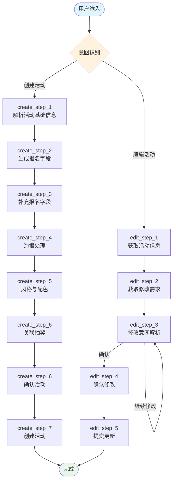

# 爱秀活动管理 Skill

## 功能概述

- 管理"爱秀活动"
- 自动解析用户自然语言中的活动类型与字段
- 支持预设模板和风格
- 支持多轮对话补充活动参数
- 提供完整的创建与编辑工作流

---

## 触发条件

当用户表达以下意图时激活本 Skill：

| 意图类型     | 触发关键词示例             |
|----------|---------------------|
| **创建活动** | 创建爱秀活动、创建报名活动、发布报名表 |
| **编辑活动** | 编辑爱秀活动、修改报名活动、修改报名表 |

---

## 全局执行规则

> ⚠️ **必须严格遵守以下规则**

1. **顺序执行**：必须按照 `*_step_1 → *_step_2 → *_step_3 → *_step_4 →*_step_5 →...` 顺序执行，禁止跳步
2. **跳步规则**：若步骤里有明确跳步的，以步骤里要求为准
3. **结果确认**：每一步必须有明确输出结果
4. **JSON 规范**：所有 JSON 输出必须合法、完整

---

## 流程路由



---

# 一、创建工作流程

## create_step_1：解析活动基础信

### 目标

从用户输入中提取以下信息：

- `act_type`：活动类型
- `title`：活动标题
- `brief`：活动介绍
- `template_id`：模板ID（默认0）
- `mark`：模板标识（默认空字符串）
- `fields`（可选）：报名字段（若可提取）
- `post_img`（可选）：海报信息（若可提取）
- `is_raffle`（可选）：关联抽奖（若可提取）

---

### 执行规则

#### 一、判断活动类型 `act_type`

根据用户描述进行语义匹配：

| 用户描述         | 判定结果                    | 处理方式                        |
| ------------ | ----------------------- | --------------------------- |
| 明确或隐含表达为报名活动 | `act_type = "designh5"` | 继续下一步                       |
| 无法判断类型       | -                       | 询问："目前只支持报名活动，请确认是否创建报名活动？" |

> 当前支持类型：

```json
{"designh5": "报名"}
```

---

#### 二、生成活动标题 `title`

要求：

- 简洁明确，10-20 字
- 体现活动主题
- 不含多余修饰词

---

#### 三、生成活动介绍 `brief`

要求：

- 50-80 字
- 包含活动目的、参与方式、亮点
- 语言自然清晰，不堆砌

---

#### 四、前置信息提取

在本步骤中，除基础信息外，**必须尝试提取以下结构化数据**：

---

##### 4.1 提取报名字段 `fields`

###### 触发条件（满足任一）：

- 用户描述中包含“报名填写 / 收集信息 / 提供信息 / 填写内容”等语义
- 明确列举字段（如：姓名、手机号、上传照片等）

###### 处理规则：

- 完全复用 create_step_2 字段生成规则
- 一旦识别，必须输出完整结构化 JSON
- 不允许半结构字段

---

##### 4.2 提取海报信息 `post_img`

###### 触发条件：

- 用户提供图片 URL
- 或明确提到“海报链接 / 图片地址 / 使用某图片”

###### 输出结构：

```json
{
  "url": "用户提供的链接",
  "size": "818*1404",
  "desc_str": ""
}
```

##### 4.3 提取关联抽奖 `is_raffle`

###### 触发条件：

- 用户描述中提到送抽奖，送抽奖机会，关联抽奖

###### 输出结构：

```json
{
  "is_raffle": 1
}
```

---

#### 五、模板匹配

在生成 `title` 和 `brief` 后执行：

---

##### 数据来源

读取配置文件：
`config/designh5/template_list.json`

数据结构：

```json
{
  "name": "模板名称",
  "des": "模板描述",
  "template_id": 8052,
  "mark": "designh5@form",
  "view_pic": "xxxxxxxxxx.png"
}
```

---

##### 匹配规则

- 仅基于：`brief` ↔ `des` 进行语义和关键词匹配
- ⚠️ **静默执行**：匹配过程不输出任何文字，不提示"模板匹配""匹配到"等信息，用户不可感知

---

##### 匹配结果处理

---

###### ① 未匹配到

```json
{
  "template_id": 0,
  "mark": ""
}
```

---

###### ② 匹配到（≥1 个）

- Step1：选择候选模板

  - 若只有1个 → 直接使用该模板
  - 若多个 → 选择最契合的一个

---

- Step2：信息展示（⚠️ 不包含模板相关信息）

展示当前已提取信息：

标题：{title}  
描述：{brief}
报名字段：{fields（若没有，显示“未设置”）}

---

- Step3：自动继续流程（无需用户确认）

  - 系统提示（固定输出）：

    > 是否确认创建该活动
  - 

---

- Step4：写入模板信息并跳转

    ```json
    {
      "template_id": "<模板ID>",
      "mark": "<模板标识>"
    }
    ```
    👉 直接跳转：create_step_7，**忽略中间流程**

---

###### 约束条件
- ❌ 不输出匹配模板相关的信息（包括"模板匹配""匹配到xxx"等任何提示文字）
- ❌ 信息展示中不得出现模板名称、模板ID等信息
- ❌ 不允许询问用户是否使用模板
- ❌ 必须展示已解析信息（title / brief / fields ）
- ❌ 必须提供至少一种预览方式
- ❌ 不得跳过展示直接创建
- ❌ 跳转流程时请忽略中间流程

---

###### 字段处理规则（create_step_7）
- 若用户未提供 fields → 传 `[]`
- 若用户已提供 fields → 使用用户字段（不得覆盖）
- scheme 一律传 `{}`

---

#### 六、输出格式

```json
{
  "act_type": "designh5",
  "title": "生成的活动标题",
  "brief": "生成的活动介绍",
  "template_id": 0,
  "mark": "",
  "fields": [],
  "post_img": {},
  "is_raffle": 0
}
```

> 注：

- `fields` 与 `post_img` 、`is_raffle`不在本步骤强制输出
- 若成功提取，应写入上下文供后续步骤使用

---


## create_step_2：生成报名字段

### 目标

在未提前获取字段的情况下，从用户描述中提取报名表单字段，生成结构化 `fields` JSON。

---

### 一、执行前置判断

在本步骤开始时，**必须先检查上下文中是否已存在 `fields`**：

---

#### 情况 1：fields 已存在（来自 create_step_1）

判定条件：

- `fields` 已为**完整结构化 JSON**
- 且字段数量 ≥ 1

👉 处理：

- ❌ **禁止重新解析**
- ❌ **禁止覆盖或修改已有字段**
- ✅ 直接跳过当前步骤

👉 流转：

```text
直接进入 create_step_3
```

---

#### 情况 2：fields 不存在

👉 进入正常字段生成流程（如下）

---

### 二、字段提取规则

将用户提到的每个"收集信息项"转为字段：

| 用户描述            | 字段示例                                       |
|-----------------|--------------------------------------------|
| "姓名"、"手机号"、"学号" | `{"label": "姓名", ...}`                     |
| "上传照片"          | `{"label": "照片", "type": "MyUpload", ...}` |

---

### 三、字段类型映射

#### 1. 文本输入类（Text）

适用于：姓名、学校、学号、公司、职务、地址等

```json
{
  "label": "字段名称",
  "type": "Text",
  "isRequire": true,
  "placeholder": "请输入XXX"
}
```

#### 2. 上传类（MyUpload）

当字段包含"上传/提交文件"语义时使用

```json
{
  "label": "字段名称",
  "type": "MyUpload",
  "isRequire": true,
  "placeholder": "请上传XXX",
  "fileType": "<类型>"
}
```

**fileType 映射**：

| 用户描述关键词       | fileType 值  |
|---------------|-------------|
| 图片、照片、头像      | `picture`   |
| 视频、录像         | `video`     |
| 音频、录音         | `audio`     |
| 文档、表格、证明      | `doc`       |

#### 3. 选择类（MySelect / MyRadio / MyCheckbox）

当字段包含"选择/选项"语义时使用

```json
{
  "label": "字段名称",
  "type": "MySelect",
  "isRequire": true,
  "placeholder": "请选择XXX"
}
```

#### 4. 手机号码类（Mobile）

当字段包含"手机/手机号码/通讯号码/号码"语义时使用

```json
{
  "label": "字段名称",
  "type": "Mobile",
  "isRequire": true,
  "placeholder": "请输入XXX"
}
```

#### 5. 身份证（IDCard）

当字段包含"身份证"语义时使用

```json
{
  "label": "字段名称",
  "type": "IDCard",
  "isRequire": true,
  "placeholder": "请输入XXX"
}
```

#### 6. 介绍类（Textarea）

当字段包含"简介/介绍/描述"语义时使用

```json
{
  "label": "字段名称",
  "type": "Textarea",
  "isRequire": true,
  "placeholder": "请输入XXX"
}
```

#### 7. 日期类（Date）

当字段包含"日期"语义时使用

```json
{
  "label": "字段名称",
  "type": "Date",
  "isRequire": true,
  "placeholder": "请选择XXX"
}
```

---

### 四、特殊处理

#### 情况 1：字段信息不完整（如缺少 options）

**必须询问用户**：
> "该字段有哪些可选项？"

**处理**：
- 用户补充前不得生成完整字段结构
- 可先记录字段名称，等待补充

#### 情况 2：用户未提供任何字段
- 此时fields为空:
```json
[]
```
#### 情况 3：弱语义
如：

- “填一些基本信息”
- “正常报名信息就行”

👉 处理：

- ❌ 不直接生成字段
- ✅ 留给 create_step_3 处理（统一兜底）
- 
---

### 五、字段默认值规范

| 属性            | 默认值    | 说明                                                               |
|---------------|--------|------------------------------------------------------------------|
| `isRequire`   | `true` | 所有字段默认必填                                                         |
| `placeholder` | 按类型生成  | 文本类："请输入XXX"，上传类："请上传XXX"，选择类："请选择XXX"                           |
| `options`     | 按类型生成  | 对象数组：[{"label":"选项1","value":"1"},{"label":"选项2","value":"2"}]   |

---

### 六、输出格式

```json
[
  {
    "label": "姓名",
    "type": "Text",
    "isRequire": true,
    "placeholder": "请输入姓名"
  }
]
```

### 七、约束条件

- ❌ 不得覆盖 create_step_1 已提取的 fields
- ❌ 不得生成重复字段（如两个“手机号”）
- ✅ 字段结构必须完整且合法
- ❌ 不得因模糊语义强行生成字段
- ✅ 仅在“明确可提取”时生成字段


---

## create_step_3：补充报名字段

### 目标

在已有 `fields` 基础上，确保字段完整可用；如有缺失，通过**最多一轮询问**进行补充。

---

### 一、执行前置判断

在本步骤开始时，必须检查 `fields` 当前状态：

---

#### 情况 1：fields 已存在且完整（来自 step_1 或 step_2）

判定条件：

- `fields` 为结构化 JSON
- 所有字段完整（无缺失属性，如 options 等）

👉 处理：

- ❌ 不强制询问
- ✅ 可直接进入下一步骤（create_step_4）

---

#### 情况 2：fields 存在但不完整

典型情况：

- 选择类字段缺少 `options`
- 仅识别出字段名称，但结构未完整

👉 处理（必须询问一次）：

> "当前报名信息中有部分字段还不完整，请补充相关选项或信息（例如：某字段的可选项）"

---

#### 情况 3：fields 为空

👉 必须询问：

> "请告诉我需要收集哪些报名信息（如：姓名、手机号等）"

---

### 二、统一询问策略

#### ⚠️ 强约束：

- ✅ **最多只允许一轮询问**
- ❌ 禁止重复追问
- ❌ 禁止多轮补充

---

### 三、用户响应处理

---

#### 情况 1：用户补充字段或信息

👉 处理：

- 新增字段 → 必须走 create_step_2 规则生成结构
- 补充信息（如 options） → 合并到原字段中
- ❌ 不覆盖已有字段
- ✅ 仅追加或补全

---

#### 情况 2：用户明确表示结束

触发语义：

- “没有了 / 不需要 / 就这些 / 可以了”

👉 处理：

- 直接结束补充
- 进入下一步骤

---

#### 情况 3：用户回答模糊

如：

- “随便”
- “你看着办”
- “默认就行”

👉 处理（兜底机制）：

如果当前 fields 为空或明显不完整，则使用默认字段：

```json id="g1x1kh"
[
  {
    "label": "姓名",
    "type": "Text",
    "isRequire": true,
    "placeholder": "请输入姓名"
  },
  {
    "label": "手机号",
    "type": "Mobile",
    "isRequire": true,
    "placeholder": "请输入手机号"
  }
]
```

---

#### 情况 4：用户未有效补充

👉 判定：

- 回答无法解析
- 或未提供有效字段信息

👉 处理：

- 若 fields 仍为空 → 使用默认字段（同上）
- 若已有部分字段 → 保持现有字段，不再补充

---

### 四、极端情况兜底

最终必须满足：

```text
fields.length ≥ 1
```

否则：

👉 强制使用默认字段（姓名 + 手机号）

---

### 五、输出结果

输出最终完整 `fields`：

```json
[
  {
    "label": "姓名",
    "type": "Text",
    "isRequire": true,
    "placeholder": "请输入姓名"
  }
]
```

---

### 六、约束条件（关键）

- ❌ 不得覆盖已有字段
- ❌ 不得重复生成字段
- ❌ 不得超过一轮询问
- ❌ 不得生成不完整字段结构
- ✅ 所有字段必须符合 create_step_2 结构规范
- ✅ 必须保证最终 fields 可用

---

### 七、流程衔接说明

| 来源情况                 | 本步骤行为    |
|----------------------|----------|
| step_1 已完整提取 fields  | 直接跳过     |
| step_1 部分提取          | 补充       |
| step_2 生成 fields     | 校验 + 补充  |
| 无任何 fields           | 询问 + 兜底  |

---


## create_step_4：海报处理

### 目标

获取或生成活动海报信息，输出标准结构 `post_img`，并确保数据完整可用。

---

### 一、执行前置判断

在本步骤开始时，必须检查上下文中是否已存在 `post_img`：

---

#### 情况 1：post_img 已存在（来自 create_step_1）

判定条件：

- `post_img` 为完整结构：

```json
{
  "url": "...",
  "size": "818*1404",
  "desc_str": ""
}
```

👉 处理：

- ❌ 不再询问用户
- ❌ 不得修改已有数据
- ✅ 直接跳过本步骤

👉 流转：

```text
进入 create_step_5
```

---

#### 情况 2：post_img 不存在

👉 进入标准询问流程（如下）

---

### 二、用户询问（必须执行）

必须发起询问：

> "是否有现成的海报图？如果有请提供图片链接"

---

### 三、分支处理

---

#### 情况 1：用户提供海报链接

判定：

- 回复中包含有效 URL

👉 处理：

```json
{
  "url": "用户提供的链接",
  "size": "818*1404",
  "desc_str": ""
}
```

---

#### 情况 2：用户明确无海报 / 不提供

触发语义：

- “没有”
- “不用”
- “你生成”
- 未提供链接

👉 处理：

1. 从已有信息中提取主题（优先级）：

   - `title`
   - `brief`

2. 生成 `desc_str`（10-50字）：

```json
{
  "url": "",
  "size": "818*1404",
  "desc_str": "活动主题简要描述"
}
```

---

#### 情况 3：用户回答不完整（新增规范）

如：

- “有”
- “我有图”

👉 必须追问：

> "请提供海报图片链接"

---

### 四、多轮交互控制

| 场景          | 处理方式        |
| ----------- |-- -----------|
| 已询问但未提供有效信息 | 必须继续引导      |
| 用户只说“有”但无链接 | 强制追问        |
| 用户未明确是否有海报  | 重复询问        |
| 未获得明确结果     | ❌ 不得进入下一步骤  |

---

### 五、输出结构

```json
{
  "url": "",
  "size": "818*1404",
  "desc_str": ""
}
```

---

### 六、约束条件（关键）

- ❌ 不得编造图片 URL
- ❌ 不得跳过询问（在 post_img 不存在时）
- ❌ 不得输出不完整结构
- ❌ 不得生成图片（仅描述 desc_str）
- ✅ size 固定为 `"818*1404"`
- ✅ desc_str 必须 10-50 字，简洁明确

---

### 七、流程衔接说明

| 来源情况                | 本步骤行为        |
| ------------------- |-- ------------|
| step_1 已提取 post_img | 直接跳过         |
| 无 post_img          | 必须询问         |
| 用户提供 URL            | 直接完成         |
| 用户无海报               | 生成 desc_str  |

---


## create_step_5：风格与配色生成

### 目标

确定活动视觉风格，生成对应配色配置。

---

### 执行规则

**处理**：学习分析页面配置`template/designh5.json`的例子，再根据活动主题（`title` + `brief` + `desc_str`）自动生成配色

---

### 配色生成结构

```json
{
  "page_config": {
    "bgColor": ""
  },
  "form": {
    "cpBorderColor": "",
    "bgColor": "",
    "titColor": "",
    "btnTextColor": "",
    "btnColor": "",
    "controlBgColor": "",
    "controlBorderColor": "",
    "controlTextColor": "",
    "controlInnerTextColor": "",
    "controlInnerPhColor": ""
  },
  "title": {
    "color": ""
  },
  "text": {
    "color": ""
  },
  "long_text": {
    "bgColor": "",
    "cpBorderColor": "",
    "color": ""
  }
}
```

---

### 生成约束

| 约束项    | 要求                                |
|--------|-----------------------------------|
| 颜色格式   | 必须为 RGBA（如：`rgba(255,255,255,1)`） |
| 可读性    | 背景与文字对比清晰                         |
| 主色     | 按钮颜色突出，主色明确                       |
| 风格     | 整体统一，不杂乱                          |

---

## create_step_6：确认活动

### 目标

创建前最终确认，避免误创建。

---

### 执行流程

1. **结构化展示**活动数据（JSON 或清晰分段文本）
2. **发起确认提问**：
   > "是否确认创建该活动？"

---

### 语义解析

| 用户意图     | 触发关键词                 | 执行行为             |
|----------|-----------------------|------------------|
| **确认创建** | 是、确认、创建、可以、没问题、ok、yes | 调用创建逻辑，输出结果      |
| **取消创建** | 否、不、取消、先不、不用了、no      | 中断流程，保留上下文，等待新指令 |

---

### 兜底策略

若无法明确识别意图：

> "请回复【是】确认创建，或回复【否】取消"

---

## create_step_7：创建活动

### 目标

整合所有步骤数据，生成配置文件，调用后端接口创建活动。

---

### 数据整合

必须包含以下字段：

```json
{
  "act_type": "",
  "title": "",
  "brief": "",
  "template_id": 0,
  "mark": "",
  "post_img": {},
  "scheme": {},
  "fields": [],
  "tag_id": "",
  "use_default_post": 0,
  "is_raffle": 0
}
```

---

### 字段来源

| 字段                 | 来源步骤                  |
|--------------------|-----------------------|
| `act_type`         | step_1                |
| `title`            | step_1                |
| `brief`            | step_1                |
| `template_id`      | step_1                |
| `mark`             | step_1                |
| `post_img`         | step_1 + step_4       |
| `fields`           | step_1 + step_2 + step_3 |
| `tag_id`           | 默认值                   |
| `use_default_post` | 默认值                   |
| `scheme`           | step_5（自动生成配色时）       |
| `is_raffle`        | step_1          |

---

### 关键约束

- ✅ 所有字段必须存在，不允许为 `null`
- ✅ 必须符合 JSON 结构

---

### 执行流程

1. **写入临时文件**
   - 路径：系统生成
   - 内容：完整活动 JSON

2. **调用创建接口**
   - 脚本：`scripts/create_event.py`
   - 参数：`{"temp_file_path": "临时文件路径"}`

---

### 返回结果处理

#### 创建成功

提取并展示：
- 活动标题`title`
- 活动ID`act_id`
- 活动地址`url`
- 平台信息`platform`
- 二维码图片`qr_code`

提示用户：
> "请使用微信扫码体验活动"

#### 创建失败

直接返回：
> "创建失败"

❌ 不得生成或编造任何结果

---

### 异常处理

| 异常场景     | 处理方式            |
|----------|-----------------|
| 任一字段缺失   | 不得调用接口，回到对应步骤补全 |
| JSON 不合法 | 重新生成，不得继续执行     |

---

### 约束条件

- ❌ 不修改已有字段内容
- ❌ 不增加未定义字段
- ❌ 不输出调试信息或解释
- ✅ 输出以结果为主

---

## create_step_8：关联抽奖

### 目标

增加活动热度，提示传播力

---

### 流程前置判断

如果已上流程中`is_raffle`已设置为`1`，**流程结束**

### 执行流程

问用户：
> "报名后解锁抽奖权益，可以激活用户参与热情，提升活动传播势能，要激活吗"

#### 1. 若用户选择："否"

- **流程结束**

#### 2. 若用户选择："是"

- 调用`scripts/update_event_raffle.py`
- 参数：
  ```json
  {"act_id": "活动ID", "is_raffle": 1}
  ```
- 完成后提示用户进入活动体验

---


# 二、编辑工作流程

## edit_step_1：获取活动信息

### 目标

根据用户提供的活动 ID、链接或标题（模糊），获取活动完整信息。

---

### 支持的输入类型

| 类型        | 格式示例            | 识别规则                    |
|-----------|-----------------|-------------------------|
| **活动 ID** | 32位字符串 或 18位纯数字 | 长度=32（字母+数字）或长度=18（纯数字） |
| **活动链接**  | 含 `http` 或 `/`  | 从链接提取 ID                |
| **活动标题**  | 支持不完整/模糊        | 语义匹配                    |

---

### 执行流程

#### 1. 提示用户输入

> "请提供需要编辑的活动ID、活动链接，或活动标题（支持模糊搜索）"

#### 2. 意图识别与分类

```
输入分类：
├─ 含 "http" 或 "/" → 【链接】
├─ 32位字符串 或 18位纯数字 → 【活动ID】
└─ 其他 → 【活动标题】
```

#### 3. 分支处理

##### 【分支A：链接处理】

- 从链接提取 `act_id`
- 若无法提取：
  > "请提供正确的活动链接（未识别出活动ID）"
  - → 重新进入当前流程

##### 【分支B：活动ID处理】

- 校验规则：长度32（字母+数字）或18位纯数字
- 不符合：
  > "请提供正确的活动ID（需为32位字符串或18位数字）"
  - → 重新进入当前流程
- 校验通过：赋值 `act_id`

##### 【分支C：标题模糊匹配】

**匹配范围**（严格限制）：
- 当前会话"最近创建的活动"
- 当前会话"最近编辑的活动"
- （如有持久记忆）历史活动记录

**匹配规则**：标题包含 或 高语义相似

**结果处理**：

| 结果      | 处理方式                                                                              |
|---------|-----------------------------------------------------------------------------------|
| 未匹配     | > "未找到相关活动，请提供更完整的标题，或直接提供活动ID/链接" <br> → 重新进入当前流程                                |
| 唯一命中    | > "找到活动：「{title}」，是否使用该活动？（是 / 否）" <br> - 确认"是"：使用 `act_id` <br> - 确认"否"：重新进入当前流程 |
| 多候选（≤5） | 列出候选活动，提示选择或重新输入精确标题                                                              |

#### 4. 获取活动信息

获得 `act_id` 后：
- 调用：`scripts/get_activity.py`
- 参数：`{"act_id": "xxx"}`

#### 5. 返回结果处理

**获取失败**：
> "活动未查询到，请确认活动ID或链接后重试"

→ 重新进入当前流程

**获取成功**：
```json
{
  "act_id": "",
  "act_type": "",
  "title": "",
  "brief": "",
  "post_img": {},
  "fields": [],
  "scheme": {},
  "tag_id": "",
  "use_default_post": 0,
  "is_raffle": 0
}
```

#### 6. 用户确认（必须）

> "请确认以上活动信息是否正确（回复：是 / 否）"

**判定**：
- 确认语义（是/对/正确/没问题/可以）→ 进入 `edit_step_2`
- 否定语义（否/不对/不是这个/错了）→ 重新进入当前流程
- 语义不明确 → "请明确回复\'是\'或\'否\'"

---

## edit_step_2：获取修改需求

### 目标

收集用户需要修改的具体内容类型。

---

### 执行流程

**提示用户**：
> "请说明需要修改的内容（如：标题、活动介绍、表单字段、海报、配色、关联抽奖等）"

**接收输入后**：
→ 进入 `edit_step_3`

---

## edit_step_3：修改意图解析与执行（核心循环）

### 目标

解析修改意图，逐项完成修改，支持多轮直到用户明确结束。

---

### 全局规则

- 本步骤为**循环流程**，反复执行直到用户明确结束
- 每次只处理"当前输入中的修改意图"
- 每次修改后必须询问是否继续

---

### 执行流程

#### 1. 意图识别（可多选）

从用户输入识别修改类型：
- 标题（`title`）
- 活动介绍/描述（`brief`）
- 海报（`post_img`）
- 配色（`scheme`）
- 表单字段（`fields`）
- 关联抽奖（`is_raffle`）

#### 2. 按类型执行修改

##### 2.1 修改标题

- 提取新标题
- 更新：`title = 新标题`

##### 2.2 修改活动介绍

- 提取新描述
- 更新：`brief = 新描述`

##### 2.3 修改海报

→ 执行 **create_step_4** 海报流程
→ 结果赋值：`post_img = 结果`

##### 2.4 修改配色

→ 执行 **create_step_5** 配色流程
→ 结果赋值：`scheme = 结果`, `tag_id = 结果`, `use_default_post = 结果`

##### 2.5 修改关联抽奖

→ 提取 -> 增加抽奖:`1` | 取消抽奖:`0`
→ 结果赋值：`is_raffle = 结果`

##### 2.6 修改表单字段（fields）（高优先级复杂逻辑）

**数据结构说明**：

```json
{
  "type": "Text",
  "label": "姓名",
  "id": "abcdefg1234",
  "placeholder": "请输入姓名",
  "isRequire": true,
  "cid": "c902137408586657792"
}
```

**关键约束**：
- `id`：字段唯一标识（前端/系统生成）
- `cid`：字段关联ID（后端生成）
- ⚠️ **一旦存在，严禁修改或丢失**

---

**操作类型识别**：

| 操作类型     | 识别方式                |
|----------|---------------------|
| 新增字段     | 用户表达"添加""增加""新建"某字段 |
| 修改字段     | 用户表达"修改""更改""调整"某字段 |
| 删除字段     | 用户表达"删除""移除""去掉"某字段 |

---

**A. 新增字段**

- 使用 **create_step_2** 生成字段结构
- ⚠️ **新增字段不得包含 `id` 和 `cid`**
- 追加到 `fields` 列表

**B. 修改字段（强约束）**

1. **定位目标字段**：
   - 优先使用 `label` 精确匹配
   - 无法精确匹配时，使用语义匹配（如"姓名"≈"名字"）

2. **执行修改**：
   - 仅允许修改：`label`、`type`、`placeholder`、`isRequire`、其他展示属性
   - **必须保留**：`id`（不变）、`cid`（不变）

**❌ 禁止**：
- 删除或生成新的 `id`/`cid`
- 替换整个字段对象

**✅ 正确示例**：
- 修改前
```json
{"label": "姓名", "id": "abc123", "cid": "cxxx"}
```
- 修改后（正确）
```json
{"label": "真实姓名", "id": "abc123", "cid": "cxxx"}
```

**C. 删除字段**

1. 定位目标字段（通过 `label` 或语义匹配）
2. 从 `fields` 中移除
3. 无需保留 `id`/`cid`

---

**D. 一致性校验（必须执行）**

每次字段修改后校验：

| 校验项     | 要求                      |
|---------|-------------------------|
| 已有字段    | 必须包含 `id` 和 `cid`，且值不变  |
| 新增字段    | 不得包含 `id` 和 `cid`       |
| 整体结构    | 符合 create_step_2 格式规范   |
| 禁止      | 字段结构错乱、缺失关键属性、类型异常      |

**校验失败**：
> "字段结构异常，请重新调整修改内容"

#### 3. 单轮修改完成后

> "当前修改已完成，请问还需要修改其他内容吗？（是 / 否）"

#### 4. 用户意图判断

| 用户回复       | 处理                           |
|------------|------------------------------|
| "是"（或语义等价） | 继续循环，返回步骤1                   |
| "否"（或语义等价） | 结束循环，输出汇总结果，进入 `edit_step_4` |
| 语义不明确      | "请回复\'是\'或\'否\'"             |

**最终修改结果汇总**：
```json
{
  "title": "",
  "brief": "",
  "post_img": {},
  "fields": [],
  "scheme": {},
  "is_raffle": 0
}
```

---

## edit_step_4：确认修改活动

### 目标

提交更新前，让用户最终确认修改内容。

---

### 执行流程

1. **提示用户**：
   > "是否确认更新活动？（是 / 否）"

2. **意图判断**：
   - "是"（或语义等价）→ 进入 `edit_step_5`
   - "否" → 返回 `edit_step_3` 继续修改
   - 语义不明确 → "请回复\'是\'或\'否\'"

---

## edit_step_5：提交更新

### 目标

将修改后的数据提交至后端系统完成更新。

---

### 执行流程

1. **写入临时文件**
   - 生成路径：`temp_file_path`

2. **调用接口**
   - 脚本：`scripts/update_event.py`
   - 参数：`{"temp_file_path": "xxx"}`

3. **返回结果处理**

#### 修改失败

> "活动更新失败，请稍后重试"

（流程结束）

#### 修改成功

返回信息：
- 活动标题：`title`
- 活动链接：`url`

> "活动更新成功！"
